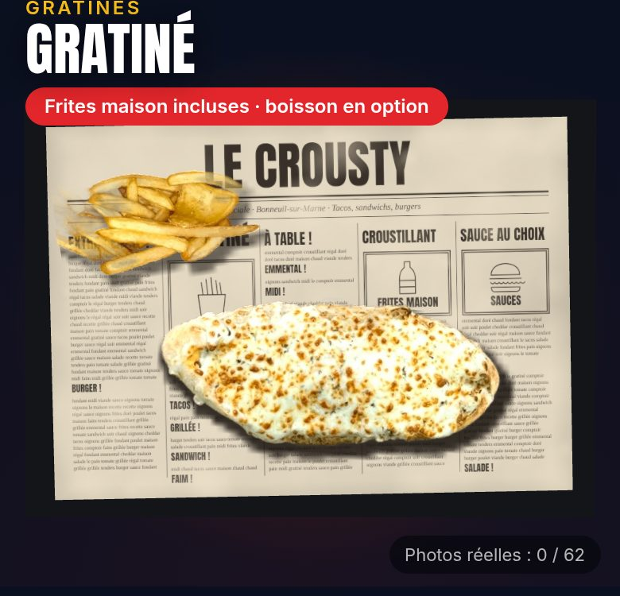
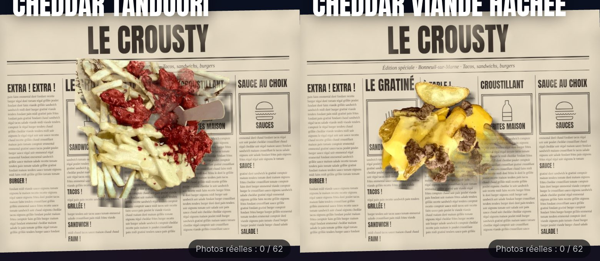
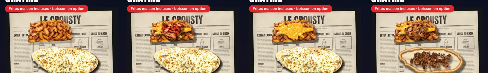
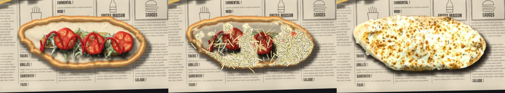
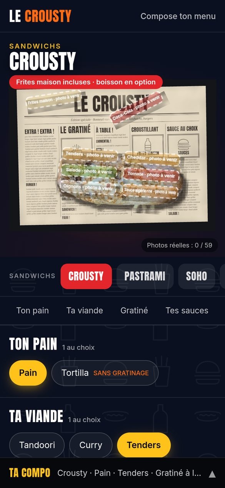
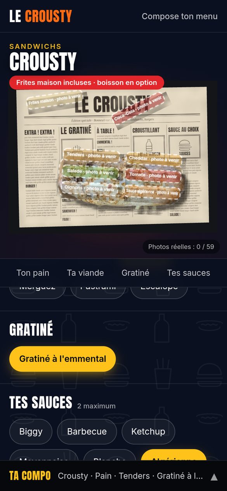
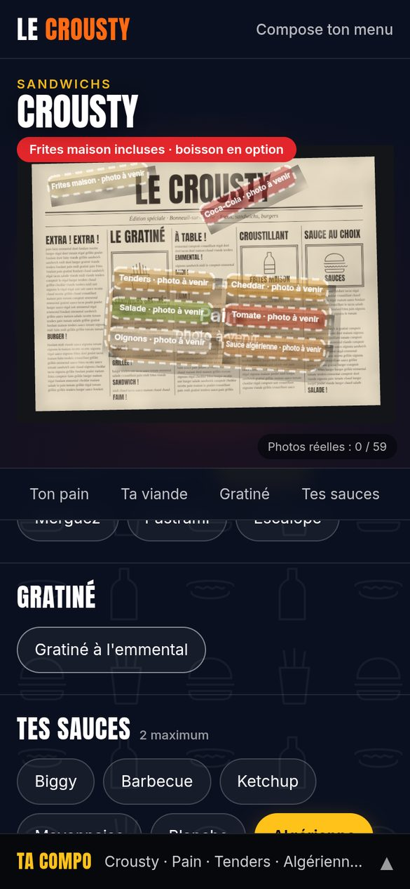

# Le Crousty — Étape 2 : le configurateur en photos réelles

> **Statut : en attente des photos.**
>
> - La première version en 3D dessinée par le code faisait « jeu vidéo ». Elle est remplacée par un rendu qui assemble **de vraies photos** de vos plats (option A).
> - Le moteur est prêt. Il ne manque que les photos : voir le [protocole](photos/protocole.md) et la [liste des photos](photos/liste-des-photos.md).

## Démo client (provisoire)

Pour montrer le rendu au client avant la séance photo, le configurateur tourne avec les photos que vous m'avez envoyées, détourées automatiquement :

| Gratiné (steak) : le fromage fond à l'arrivée | Frites garnies : cheddar tandoori et cheddar viande hachée |
|---|---|
|  |  |

### Mise à jour : l'essentiel seulement, et les frites cheddar dans le menu gratiné

- **Moins d'options :** le configurateur n'affiche plus les sauces, les crudités ni les boissons, que le client connaît déjà. Restent la viande, les suppléments, les frites et les frites cheddar. La carte, elle, les liste toujours.
- **Gratiné plus rapide :** l'emmental pleut et l'on arrive sur la vraie photo en environ 1,7 s, au lieu de 3,5 s.
- **Frites cheddar :** elles n'ont plus de catégorie à elles. Ce sont une **option en plus du menu gratiné** (cheddar viande hachée, cheddar tandoori, cheddar bacon), et elles ne se font **qu'avec les frites paysannes** :
  - choisir une frites cheddar passe automatiquement aux paysannes ;
  - revenir aux frites maison retire la frites cheddar.
- **Animation des frites :** les frites paysannes arrivent, le cheddar fondu coule depuis le centre, puis la viande tombe dessus. Changer d'option fait recouler le cheddar.

  
- **Images :**
  - les frites maison, les paysannes, la viande (utilisée pour « viande hachée ») et le tandoori viennent de vos nouvelles photos, détourées de leur plateau (`tools/photos/demo/frites.py`) ;
  - le cheddar fondu et le bacon en miettes sont dessinés.



- **Gratiné : la séquence complète.** Le pain ouvert apparaît, la viande tombe dedans, puis les suppléments, les crudités et les sauces (le filet de sauce se dessine de gauche à droite). Ensuite l'emmental râpé pleut sur le sandwich, et le four le transforme en votre photo du gratiné, avec une lueur chaude et de la vapeur. À chaque changement (viande, sauce, crudité…), le fromage fond à l'envers, la garniture change et la séquence se rejoue.
- Pour cette séquence, il a fallu **fabriquer** les étapes intermédiaires, faute de photos. Elles sont marquées `synthese` dans `src/data/photos.json` et viennent de `tools/photos/demo/` :
  - le pain ouvert reprend la forme du pain de votre photo ;
  - le steak, le kebab, le poulet, le curry et le tandoori sont recomposés à partir des morceaux de viande de vos photos de frites garnies ;
  - les sauces, les crudités, les autres suppléments et le fromage râpé sont dessinés.

  Ces images ont un rendu d'illustration. Chacune sera remplacée automatiquement par la vraie photo du même nom dès qu'elle sera prise.
- Seuls les produits dont on a les photos sont proposés (le Gratiné et les deux frites garnies). Le reste de la carte réapparaît automatiquement dès que ses photos arrivent.
- Ces photos sont marquées « démo » dans `src/data/photos.json` et ne comptent pas dans le compteur de la séance.
- La photo « avant le four » du gratiné a été reconstituée à partir de la photo « sorti du four ». Les vraies photos, prises selon le [protocole](photos/protocole.md), donneront un rendu plus net : même cadrage, même lumière et un détourage propre.

## Ce que vous verrez

| Crousty gratiné (vraie photo, provisoire) | Le fromage qui fond | Photos pas encore prises |
|---|---|---|
|  |  |  |

Le gratiné de ces captures vient d'une de vos photos, détourée automatiquement. C'est une démonstration **provisoire**, à remplacer par vos propres photos.

Tant qu'une photo manque, une étiquette « photo à venir » prend sa place, et un compteur en bas à droite indique où en est la séance (`Photos réelles : 0 / 62`).

## Comment ça marche

1. Chaque ingrédient est **photographié seul, vu de dessus**, toujours au même endroit et à la même hauteur ([protocole](photos/protocole.md)).
2. Vous déposez les photos dans `photos/brutes/`, nommées comme dans la [liste](photos/liste-des-photos.md).
3. `node tools/photos/preparer.mjs` fait le reste :
   - détourage automatique (le fond disparaît) ;
   - recadrage et mise à la même échelle ;
   - export en WebP léger dans `public/photos/`, avec le manifeste `src/data/photos.json`.
4. Le configurateur assemble les photos en direct :

| Action | Ce qui se passe à l'écran |
|---|---|
| Choisir une viande, un supplément, une crudité | La photo de l'ingrédient tombe dans le pain ouvert, avec un rebond et une ombre qui se resserre |
| Changer de viande | L'ancienne se soulève et disparaît, la nouvelle tombe |
| Gratiné | La garniture tombe dans le pain, l'emmental râpé pleut dessus (la photo « avant le four » apparaît par plaques), puis fondu irrégulier vers « sorti du four », avec une lueur chaude et de la vapeur. Tout changement de garniture rejoue la séquence |
| Tortilla | La garniture tombe sur la tortilla à plat, qui se change en tortilla roulée au repos. Le gratiné reste indisponible |
| Sauces (2 max) | Le filet de sauce se dessine sur la garniture, de gauche à droite |
| Frites garnies | Le cheddar s'étale depuis le centre en coulures sur la photo des frites, puis le poulet ou le bacon tombe dessus |
| Boisson | La canette arrive en glissant |
| Menu | Tout est posé sur la photo de votre plateau papier journal |
| Relief | La vue s'incline légèrement sous le doigt (et doucement au repos) : les couches du dessus bougent plus que le plateau |

Rien n'a changé dans la carte (`menu.json`), la logique des options, le formulaire accessible et le récap. Seul l'affichage a été remplacé.

## Lancer le site

```bash
npm install
npm run dev                 # http://localhost:5173
npm test                    # 126 tests (carte, options, liste des photos)
npm run photos:liste        # régénère la liste des photos (et coche celles reçues)
cd tools/photos && npm install && cd ../..
node tools/photos/preparer.mjs   # traite les photos de photos/brutes

# Images de la démo (Python 3 + numpy, scipy, Pillow), dans cet ordre :
cd tools/photos/demo && python3 pain.py && python3 viandes.py && python3 dessins.py && python3 supplements.py && python3 fromage.py
```

## Limites connues

| Sujet | Quand |
|---|---|
| Les emplacements des ingrédients dans le pain seront réglés sur les vraies photos (aujourd'hui : valeurs de départ) | Dès réception du premier lot |
| Burgers, hot-dogs, tacos, croques, brasserie, salade, starters : la liste des photos est prête (lot 2) ; leur angle de prise de vue (de profil pour les burgers ?) est à valider | Étape 3 |
| Poids : le moteur d'affichage (three.js) pèse ~240 Ko compressés ; un moteur 2D plus léger est possible pour ce rendu photo | Étape 5 |
| Pages accueil, carte, galerie, infos | Étape 4 |
