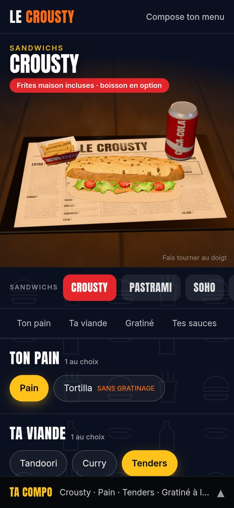
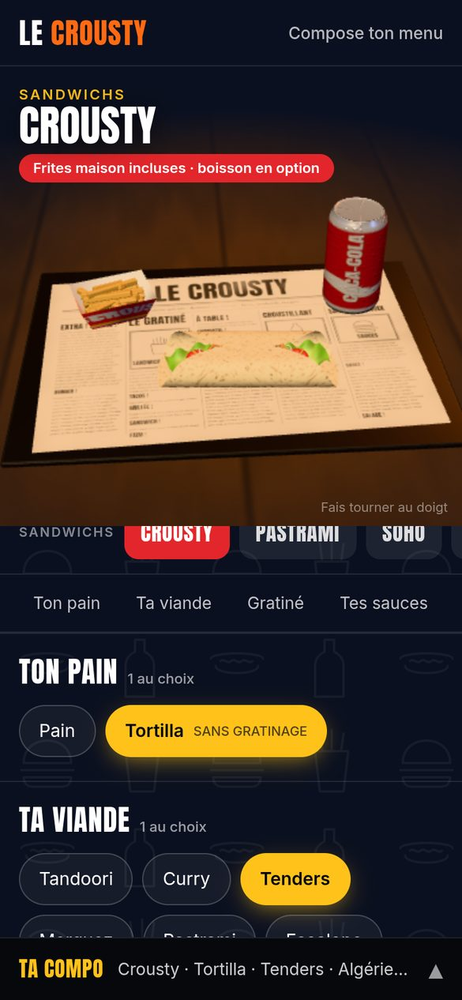
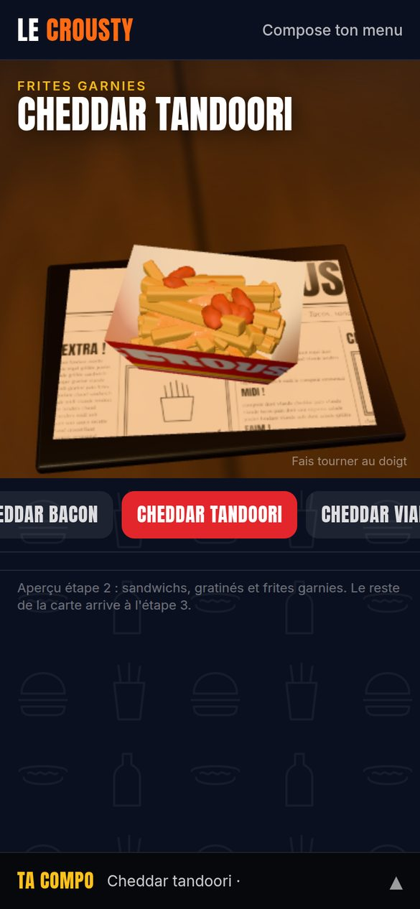
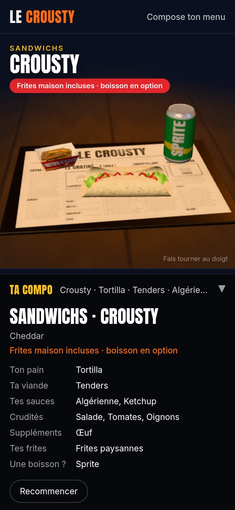

# Le Crousty — Étape 2 : le configurateur sur un produit complet

> **Statut : à valider.** Produit de référence : le **Crousty** (viande au choix → tenders), avec pain ou tortilla, gratiné emmental, sauces, crudités, suppléments, frites maison ou paysannes, et boisson.

## Captures (téléphone, 390 × 844)

| Crousty gratiné, frites, Coca | Le gratiné en train de fondre | Tortilla (gratiné indisponible) | Frites cheddar tandoori | Récap |
|---|---|---|---|---|
|  |  |  |  |  |

Ces captures viennent d'un Chromium sans carte graphique (rendu logiciel). Sur un vrai téléphone, l'image est plus nette et les animations plus fluides.

## Voir l'aperçu

Aperçu en ligne (privé, à ouvrir sur ton téléphone) : https://claude.ai/artifact/5ksqNdfKfwPSTTJxTDWDhv

## Lancer le site

```bash
npm install
npm run dev            # http://localhost:5173
npm run dev -- --host  # pour l'ouvrir depuis un téléphone sur le même Wi-Fi
```

Autres commandes : `npm test` (68 tests), `npm run build` (tests + typage + build), `npm run menu:report` (liste des manques de la carte).

## Ce qu'il faut regarder

Chaque option a un effet visible qui démarre en moins de 150 ms :

| Action | Ce qui se passe en 3D |
|---|---|
| Choisir une viande | Le pain s'ouvre, la viande tombe avec un petit rebond, le pain se referme. Changer de viande : l'ancienne s'envole, la nouvelle arrive |
| Gratiné | Le fromage apparaît, fond, coule sur les bords, puis dore (zones grillées, cloques) avec de la vapeur. Décocher : il s'efface |
| Pain → Tortilla | Le pain part, la tortilla arrive à plat, la garniture tombe dessus, la galette s'enroule. Le gratiné se retire tout seul et devient indisponible (« Pas avec : Tortilla ») |
| Sauces (2 max) | Un filet se dessine en zigzag, une goutte au bout. La 3ᵉ sauce est grisée |
| Crudités | La salade virevolte en tombant, les tomates tombent, les oignons pleuvent |
| Suppléments | Chaque ingrédient se pose à sa place dans l'empilement (œuf, cheddar, bacon, boursin…) |
| Frites paysannes | Les frites maison repartent, les paysannes (potatoes) tombent dans la barquette |
| Boisson | La canette arrive en glissant et oscille ; changer de boisson l'échange |
| Formule | Le tout est posé sur le plateau papier journal (clin d'œil à la photo du plat) |
| Repos | Après 3 s sans toucher, la scène tourne lentement. Rotation au doigt, zoom limité |

Autres produits déjà ouverts dans le sélecteur, **sans une ligne de code en plus** (tout vient de `menu.json`) :
- les 7 sandwichs ;
- le Gratiné ;
- les 3 frites garnies (le cheddar coule sur les frites).

## Ce qui est en place

- **Données** : `menu.json` complet (12 catégories, 55 produits), validé par des tests à chaque build.
- **Domaine** (`src/domain`) : `resolveBuild`, règles de sélection, récap. Tout est testé, sans React ni Three.js.
- **Scène 3D** (`src/three`) :
  - supports : pain qui s'ouvre, tortilla qui s'enroule, barquette, boisson ;
  - 14 formes d'ingrédients procédurales ;
  - shader du fromage (fonte, coulures, dorure), nappage cheddar, filets de sauce, vapeur ;
  - canettes génériques (nom en clair, sans logo), plateau papier journal ;
  - lumière chaude, ombres de contact.
- **Interface** (`src/ui`) :
  - de vrais boutons radio et cases à cocher, utilisables au clavier et au lecteur d'écran ;
  - annonces des changements (« Gratiné à l'emmental ajouté ») ;
  - description de la scène pour les lecteurs d'écran ;
  - « réduire les animations » respecté (pas de rotation auto, pas de vapeur, entrées courtes).
- **Vitrine** : aucun prix, aucune commande. Le récap « Ta compo » résume la composition.

## Limites connues (prévues aux étapes suivantes)

| Sujet | Étape |
|---|---|
| Burgers, hot-dogs, tacos, croques, brasserie, salade, starters : les données sont prêtes, il manque leurs supports 3D (bun, pain hot-dog, tacos plié, pain de mie, assiette, bol, pot) et quelques formes (brochettes, wings, onion rings, mac & cheese) | 3 |
| Chargement des modèles `.glb` d'un designer (le champ existe dans `menu.json`) | 3 |
| Pages accueil (sandwich qui se sépare au scroll), carte, formules, galerie, infos, pied de page, routes et référencement | 4 |
| Version 2D animée si la 3D n'est pas possible (pour l'instant : message + formulaire complet) | 5 |
| Performance : l'interface se charge d'abord (~90 Ko compressés), puis la 3D (~270 Ko compressés, objectif ~200). Vapeur et ombres à alléger sur les petits téléphones. Mesures sur de vrais appareils | 5 |

## Questions pour valider l'étape 2

1. Le rendu te donne-t-il faim ? Qu'est-ce qui fait « faux » en premier (pain, fromage, frites, tenders…) ?
2. La mise en page mobile (3D en haut, options dessous, récap en bas) te convient-elle ?
3. Le vrai pain ressemble-t-il à celui de la photo du plat (long, doré) ? Une photo du pain seul m'aiderait.
4. Je passe à l'étape 3 (toute la carte) ?
