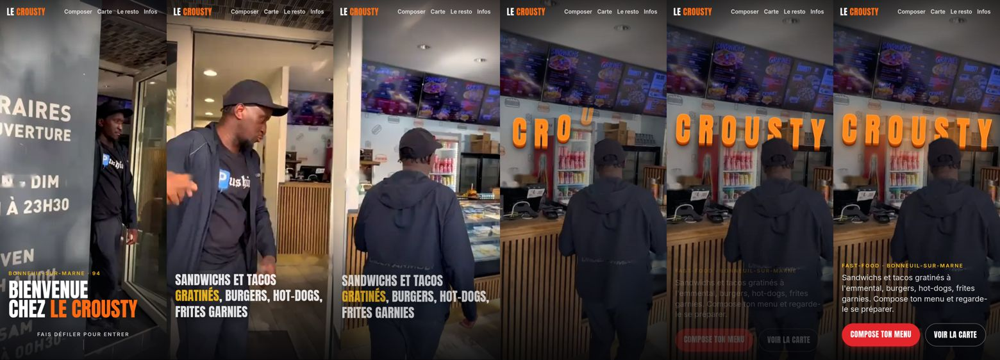
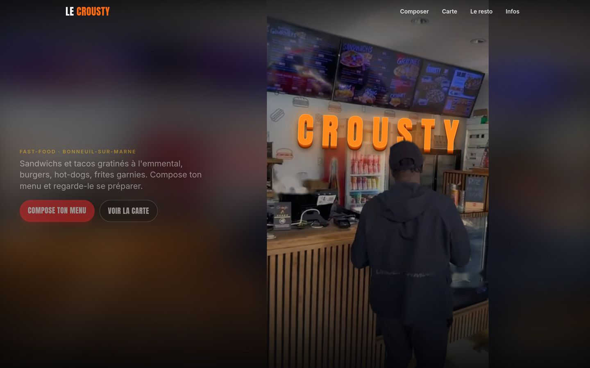
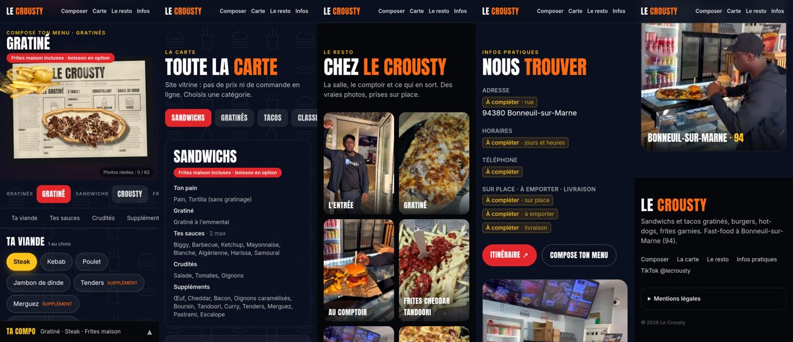

# Le Crousty — Étape 4 : le site complet

> **Statut : à valider.** Le site est une seule page vitrine, sans prix ni commande. On y circule avec l'en-tête : Composer · Carte · Le resto · Infos.

## Accueil : on entre chez Le Crousty en faisant défiler la page

Sur le modèle de la vidéo de référence (le restaurant « INTI »), la vidéo TikTok du Crousty devient une animation pilotée par le défilement :

1. **À la porte.** On part de la devanture, avec l'accueil à l'entrée : « Bienvenue chez Le Crousty ».
2. **L'entrée.** Chaque cran de défilement avance la caméra. Au milieu, un sous-titre annonce « Sandwichs et tacos gratinés, burgers, hot-dogs, frites garnies ».
3. **Au comptoir.** La caméra s'arrête face au comptoir et avance encore un peu, et la salle s'assombrit. Le nom **CROUSTY** tombe alors dans la salle, lettre par lettre, en 3D orange. Les lettres passent **derrière la personne** (détourée), puis s'allument comme un néon.
4. **Les boutons** « Compose ton menu » et « Voir la carte » apparaissent.



| Sur ordinateur | Les autres sections (mobile) |
|---|---|
|  |  |

La vidéo est verticale. Sur ordinateur, elle occupe donc une colonne à droite, sur un fond flou tiré de la même image, et les textes s'affichent à gauche.

**Comment c'est fait** (`tools/hero/`) :

| Étape | Outil |
|---|---|
| Découper 0 → 5,6 s de la vidéo en 85 images (15 par seconde) | `images.py` |
| Effacer le filigrane TikTok (« TikTok @lecrousty »), qui change de place au milieu de la vidéo | `filigrane.py` (masque appris sur la vidéo, puis reconstruction des pixels) |
| Étalonnage « cinéma » léger : contraste, tons chauds | `images.py` |
| Détourer la personne sur la dernière image, pour que les lettres passent derrière elle | `personne.mjs` (même détourage que les photos du configurateur) |
| Images de la galerie | `galerie.py` |

```bash
python3 tools/hero/images.py <video.mov>     # public/hero/*.webp + src/data/hero.json
node tools/hero/personne.mjs                 # public/hero/fin-personne.webp
python3 tools/hero/galerie.py <video.mov>    # public/galerie/*.webp
# Python 3 + numpy, opencv-python-headless, imageio-ffmpeg
```

- **Poids :** environ 2,1 Mo d'images pour l'accueil. Quelques images réparties sur toute la marche se chargent d'abord, puis les autres complètent. Pas de vidéo à télécharger.
- **« Réduire les animations » activé :** l'accueil affiche directement l'image finale, avec le nom et les boutons.
- **Une meilleure vidéo, un meilleur rendu :** une vidéo filmée exprès, en horizontal, sans personne et en 4K, avec une marche lente et stable de la rue jusqu'au comptoir, donnerait un résultat proche de la vidéo de référence. Pour l'intégrer, il suffit de relancer `images.py` avec cette vidéo.

## Compose ton menu (nouvelle version)

L'assemblage animé des photos est abandonné : il ne faisait pas assez professionnel. La section est maintenant **par catégorie**, sans visualisation :

| Onglet | Photo | Ce qu'on choisit |
|---|---|---|
| Gratinés | Le gratiné et ses frites | Viande, suppléments, frites, frites cheddar |
| Sandwichs | Le sandwich tandoori-curry | Le sandwich (7), pain ou tortilla, gratiné, suppléments, frites |
| Burgers | Le burger et ses frites | La gamme (Classics, Gourmets, Smash), le burger, taille ou viande doublée, frites |

- La photo change seulement avec l'onglet, et chaque produit affiche sa composition tirée de la carte.
- Les sauces, crudités et boissons ne sont pas proposées ici : le client les connaît déjà, et la carte les liste.
- Un récap « Ta compo » jaune résume le choix. Le site reste une vitrine, sans commande ni prix.
- Les photos sont dans `public/menus/`. Le code de l'ancien rendu photo (`src/photo/`, `src/ui/Configurator.tsx`) n'est plus chargé par le site et peut être supprimé.

## Les sections

| Section | Contenu | Source |
|---|---|---|
| Compose ton menu | Par catégorie (Gratinés, Sandwichs, Burgers) : une photo, les produits, les options, le récap | `menu.json`, `public/menus` |
| La carte | Onglets par catégorie. Pour chaque catégorie : sa formule et ses options au choix (pain, sauces, crudités, suppléments…) ; pour chaque produit : sa composition. Le bouton « Le composer » ouvre le produit dans le configurateur | `menu.json` |
| Le resto | Galerie de vraies images, tirées de la vidéo et de vos photos, et lien TikTok | `public/galerie`, `restaurant.json` |
| Nous trouver | Adresse, horaires, téléphone, services, bouton « Itinéraire » (une recherche Google Maps, en attendant l'adresse exacte) | `restaurant.json` |
| Pied de page | Rappel, liens, mentions légales | `restaurant.json` |

## Rien n'est inventé : ce qui manque est affiché « À compléter »

Ces informations sont dans `src/data/restaurant.json`. Le site affiche une étiquette jaune « À compléter » tant qu'elles manquent :

| Information | Où je l'ai cherchée |
|---|---|
| Rue (adresse exacte) | Inconnue ; seuls le code postal et la ville (94380 Bonneuil-sur-Marne) sont connus |
| **Horaires** | Ils sont affichés sur la porte, dans la 1ʳᵉ seconde de la vidéo, mais le début des heures est coupé à l'image. On lit : « Lun – Dim …h à 23h30 », « Ven …h à 00h », « Sam … à 00h30 ». **À me donner en entier** |
| Téléphone | Inconnu |
| Sur place, à emporter, livraison (et liens Uber Eats, Deliveroo…) | Inconnus |
| Mentions légales (société, SIRET, directeur de la publication, hébergeur) | Obligatoires avant la mise en ligne |
| Descriptions des produits | Non affichées : la composition tirée de la carte les remplace |

Le compte TikTok **@lecrousty** vient du filigrane de vos vidéos.

## Choix faits (à me dire si ce n'est pas ce que vous vouliez)

- « Garder la partie de la présentation en haut » : j'ai compris que l'accueil animé (la présentation du restaurant) ouvre le site, et que le configurateur vient juste en dessous, avant la carte.
- La personne de la vidéo apparaît sur l'accueil et dans la galerie, comme dans votre TikTok.
- Le nom affiché dans la salle est « CROUSTY », dans la police et les couleurs du site.
